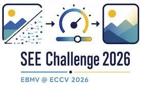
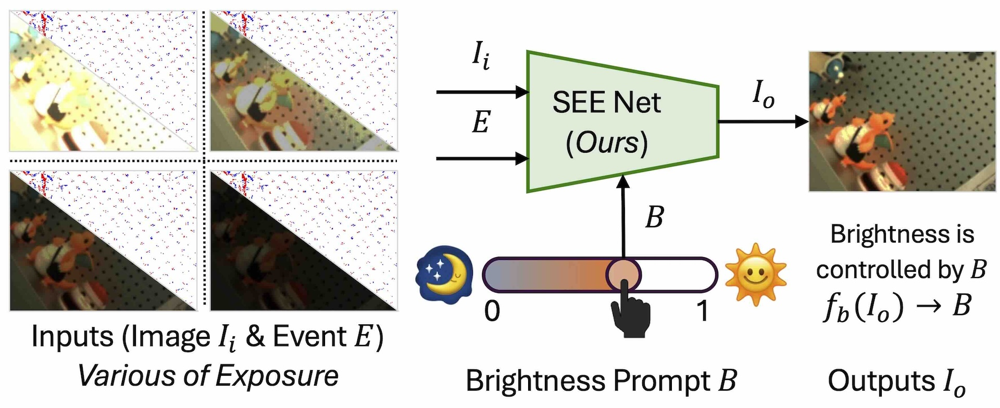
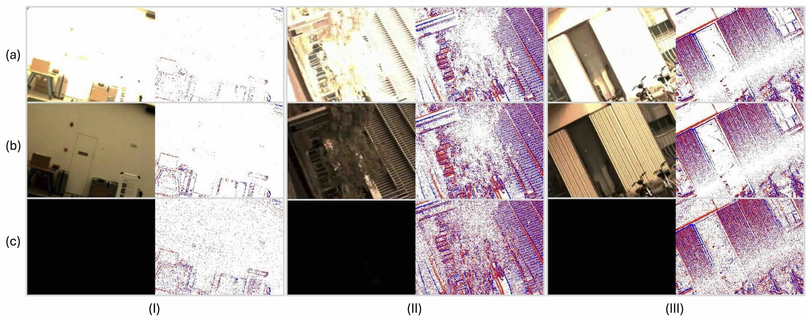
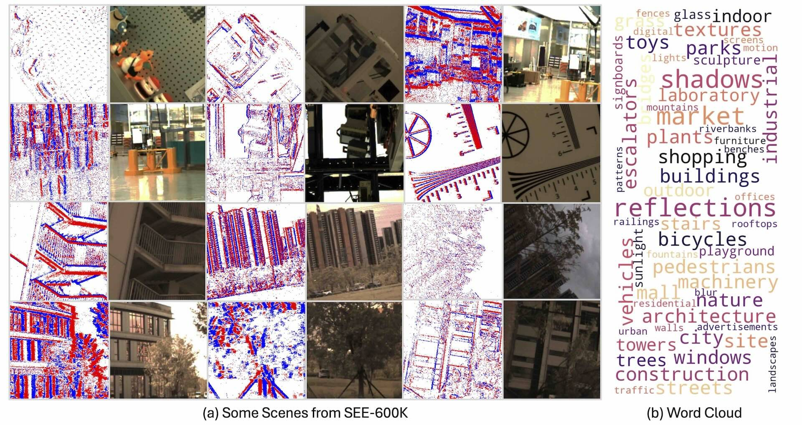
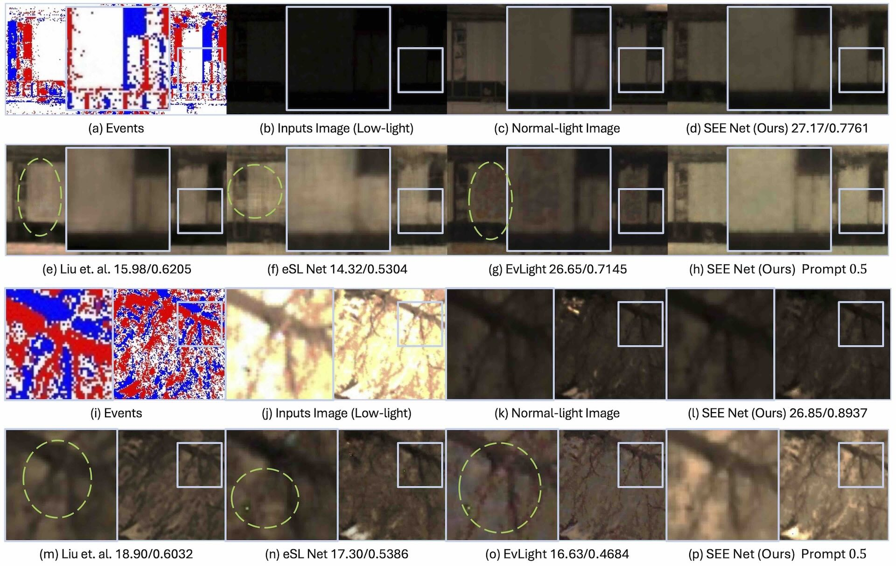

# SEE: See Everything Every Time 🌟👀
Welcome to the **SEE** project repository! We introduce a new framework for enhancing images across a broad light range using event-based cameras. Our approach adjusts brightness dynamically to enhance image quality in both low and high light conditions. This repository contains the data and code for the **SEE-600K dataset** and **SEE-Net framework**.

## 🎯 Overview
In this project, we explore how to use event-based cameras, with their high dynamic range (HDR), to handle images under various lighting conditions. We propose the **SEE-600K dataset**—a large-scale dataset capturing images under a range of lighting conditions—and a novel framework, **SEE-Net**, that can adjust brightness smoothly and effectively using events.

---

## 🔥 SEE Challenge 2026

<p align="center">
  
</p>

We are organizing the **SEE Challenge 2026: Event-Guided Low-Level Imaging**, associated with **EBMV @ ECCV 2026**: **Event-Based Multimodal Vision: Imaging, Perception, and Understanding**.

This challenge focuses on **event-guided brightness adjustment under broad lighting conditions**. Participants are asked to use RGB frames and event streams to restore well-exposed, structurally faithful, and visually clear images from challenging illumination scenes, including low light, over-exposure, mixed illumination, and high-contrast conditions.

The challenge is based on **SEE-600K**, a large-scale RGB-event dataset introduced in our paper.

### Task

Given:

- an RGB image captured under challenging illumination,
- the corresponding event stream or event representation,
- optional brightness prompt or metadata if provided,

participants should output a **brightness-adjusted RGB image**.

The output should preserve scene structure, recover useful details, maintain natural color appearance, and avoid unrealistic hallucination.

### Dataset

The challenge uses **SEE-600K**, which contains:

- 610,126 images with corresponding event data,
- 202 real-world scenarios,
- low-light, normal-light, and high-light conditions,
- multiple lighting groups per scene,
- broad illumination variations for event-guided image enhancement.

Dataset link: [https://huggingface.co/datasets/yunfanlu/SEE-600K](https://huggingface.co/datasets/yunfanlu/SEE-600K)

### Evaluation

The official evaluation will be conducted on the test set.

| Metric | Meaning | Ranking |
| --- | --- | --- |
| PSNR | Pixel-level reconstruction accuracy | Primary, higher is better |
| SSIM | Structural similarity | Secondary, higher is better |
| LPIPS | Perceptual distance | Secondary, lower is better |

### Timeline

| Date | Event |
| --- | --- |
| May 10, 2026 | Challenge website opens |
| May 25, 2026 | Validation server online |
| June 25, 2026 | Test data released and test server online |
| July 3, 2026 | Test submission deadline |
| July 10, 2026 | Results announcement, tentative |

### Challenge Visuals

| Problem Definition | Dataset Samples |
| --- | --- |
|  |  |
| Input RGB under challenging illumination + event representation -> brightness-adjusted RGB output. | Examples cover low-light, normal-light, high-light, mixed illumination, and event views. |

| Scenario Coverage | Baseline Visualization |
| --- | --- |
|  |  |
| 202 real-world scenarios with broad scene categories and multiple lighting groups. | SEE-Net uses RGB frames, event data, and a brightness prompt for controllable output exposure. |

### Links

- **Workshop Website**: [https://eventbasemultimodalvision.github.io](https://eventbasemultimodalvision.github.io)
- **Dataset**: [https://huggingface.co/datasets/yunfanlu/SEE-600K](https://huggingface.co/datasets/yunfanlu/SEE-600K)
- **Baseline Code**: [https://github.com/yunfanLu/SEE](https://github.com/yunfanLu/SEE)
- **Competition Page**: Coming soon
- **Evaluation Server**: Coming soon
- **Leaderboard**: Coming soon

---

## 📚 Paper Summary
In our research paper, we:
- Collect the **SEE-600K dataset** consisting of 610,126 images and corresponding events under 202 scenarios with a range of lighting conditions.
- Introduce the **SEE-Net framework**, which effectively adjusts image brightness using event-based data.
- Demonstrate that our framework performs well across a broad range of lighting, from very low to very high light levels.
- Show the flexibility of our method through pixel-level brightness adjustments, which can be useful for various post-processing applications.

---

## 📂 Data Availability
The datasets supporting the results of this article are publicly available:
- **SEE-600K Dataset**:
  - [OneDrive](https://hkustgz-my.sharepoint.com/:f:/g/personal/ylu066_connect_hkust-gz_edu_cn/EkNi59p2uHJFjxyeQraiVhgBSs1GnxK4DyCUP-uZhEspCA?e=ZpwOvY)
  - [Huggingface](https://huggingface.co/datasets/yunfanlu/SEE-600K)
- **SDE Dataset**: [SDE Dataset GitHub](https://github.com/EthanLiang99/EvLight)

---

## 🛠️ Code & Framework

### 🎥 SEE-Net Framework

The **SEE-Net** framework is designed to adjust the brightness of images under a variety of lighting conditions. It utilizes event-based data to enhance low-light and high-light images and improve their overall quality.

Key Features:
- **Brightness Adjustment** 🌈: Our framework allows for pixel-level brightness adjustment based on the events captured by the camera.
- **Compact & Efficient** ⚡: SEE-Net is designed with efficiency in mind, with only 1.9 million parameters, making it suitable for real-time applications.

### Pretrain Model

We provide a Google Drive folder that includes pretrained checkpoints, evaluation logs, and the corresponding experiment files for the released baselines. The package is organized by method, so you can quickly locate the checkpoint you need and reproduce the reported results with minimal setup.

**Download link:**

https://drive.google.com/drive/folders/1SWR9YVIrqFEkGGKrv3wSC5RqmMIEYjV2?usp=sharing

**Folder contents:**

```text
.
├── EIFT_AAAI_SEE
│   ├── checkpoint-010.pth.tar
│   └── py_SEE_eval_for_model.INFO.log
├── eSl_SEE
│   ├── checkpoint.pth.tar
│   ├── py_main.INFO.log
│   └── py_SEE_eval_for_model.cc2931668b9f.root.log.INFO.20240923-171527.3734002.log
├── EvLight
│   └── checkpoint.pth.tar
├── SEENet_SEE
│   ├── checkpoint.pth.tar
│   ├── py_SEE_eval_for_model.INFO.log
└── TEST_RESULTS.md
```

### 🖥️ Installation

To get started with this repository, clone it using the following command:

```bash
git clone https://github.com/yunfanLu/SEE.git
```

Next, install the required dependencies:

```bash
pip install -r requirements.txt
```

You can then use the code to process images using our **SEE-Net** framework and adjust their brightness using the **SEE-600K** dataset.

---

## 💬 Usage

1. **Download the SEE-600K dataset**
   
   Download the SEE-600K dataset using the link provided above.

3. **Data preprocessing and alignment**
   Before training, the raw data must be properly extracted and aligned.

   * For data extraction, follow the step-by-step instructions in the `tools/` directory.
   * For temporal and spatial alignment, please refer to the IMU-based registration tool:
     [https://github.com/yunfanLu/IMU-Registration-Tool](https://github.com/yunfanLu/IMU-Registration-Tool)
     This tool provides millisecond-level alignment between RGB frames and events.
   * If you download the dataset from Hugging Face, the data has already been aligned and can be used directly without additional registration.

4. **Train the SEE-Net model**
   We provide two training configurations, **SEE** and **SDE**, both located in the `options/` directory.

   * The full training command is already written in
     `options/SEE/SEENet_SEE.sh`.
   * Before running, modify the paths in the script to match your local environment (dataset path, log directory, dependencies).
   * A typical training command is:

     ```bash
     python see/main.py \
       --yaml_file="options/SEE/SEENet_SEE.yaml" \
       --log_dir="./logs/SEE/SEENet_SEE/" \
       --alsologtostderr=True
     ```
   * During training, the model learns to reconstruct and adjust image brightness under a wide range of lighting conditions using event guidance.

5. **Brightness adjustment with exposure prompts**
   After training, the SEE model supports continuous brightness control via an exposure (brightness) prompt **B**.

   * By changing the value of **B**, the model can generate images with different exposure levels from the same input.
   * Internally, this is implemented by sampling different exposure prompts and decoding the corresponding outputs:

     ```python
     # 3. more exposure prompt
     exposure_prompt = torch.ones(size=(B, 1, 1, 1)) * exposure_B
     exposure_prompt = exposure_prompt.to(images.device)
     exposure_normal_reconstructed = self._decoding(light_inr, exposure_prompt)
     ```
   * In evaluation mode, increasing **B** results in brighter outputs, while decreasing **B** produces darker images.
   * This design enables pixel-level, continuous brightness adjustment as a post-processing step, without retraining the model.

6. **Notes**

   * The optimal operating range of the brightness prompt is typically around **B ≈ 0.5**, which corresponds to normal exposure.
   * Extreme values of **B** are mainly intended for analysis and visualization, rather than as target outputs.
   * The framework is designed for brightness adjustment rather than full HDR reconstruction.


---

## 🖼️ Example Outputs

Here are some example outputs generated using our framework:

- **Low-Light Enhancement** 🌙: Images processed under very low-light conditions.
- **High-Light Recovery** 🌞: Images processed under overexposed or bright light conditions.


## IMU-Based Registration-Tool

I released the registration tool separately to this repository - [Registration-Tool](https://github.com/yunfanLu/IMU-Registration-Tool).

---

## 📄 Citation

If you use the SEE-600K dataset or SEE-Net in your research, please cite our paper:

```bibtex
@article{lu2025SEE,
  title={SEE: See Everything Every Time - Adaptive Brightness Adjustment for Broad Light Range Images via Events},
  author={Yunfan Lu, Xiaogang Xu, Hao Lu, Yanlin Qian, Pengteng Li, Huizai Yao, Bin Yang, Junyi Li, Qianyi Cai, Weiyu Guo, Hui Xiong},
  year={2025},
}
```

---

## 🐱‍🏍 Contributions

We welcome contributions to this project! If you have any ideas or improvements, feel free to fork this repository and create a pull request. 💪

- Bug fixes
- New features
- Improvements to documentation

---

## 📞 Contact

If you have any questions or need assistance, feel free to reach out to us!

- **Yunfan Lu**: ylu066@connect.hkust-gz.edu.cn
- **GitHub**: [yunfanLu](https://github.com/yunfanLu)

---

✨ We hope you find the SEE project helpful and look forward to your contributions! 😄
